# Screenshots of Website

This folder documents the Buckeye Marketplace website screens, organized by the main user workflows.

## Storefront and Product Browsing

### Front Page

The landing page shows the Buckeye Marketplace hero section, navigation, search, category filters, sort controls, and product catalog preview.

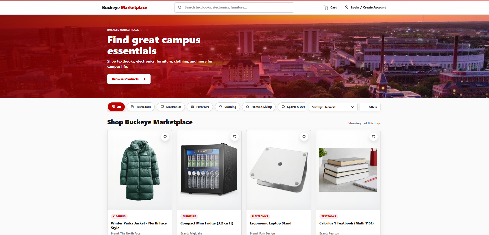

### Product Catalog

The main shopping view displays all marketplace listings in a product grid.

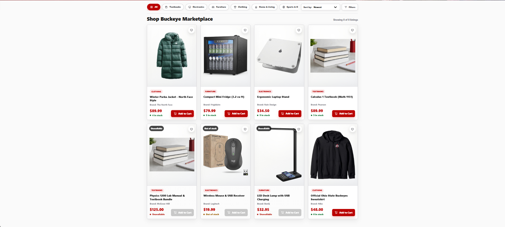

### Category Filter

The catalog filtered to the Textbooks category.

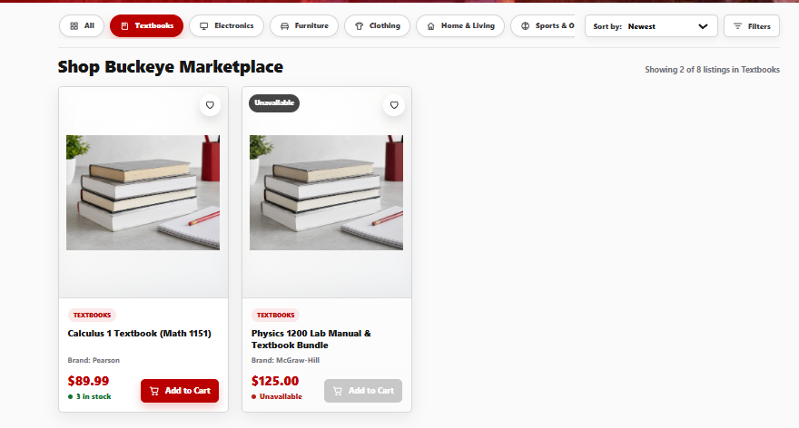

### Price Sorting

The catalog sorted by price from high to low.

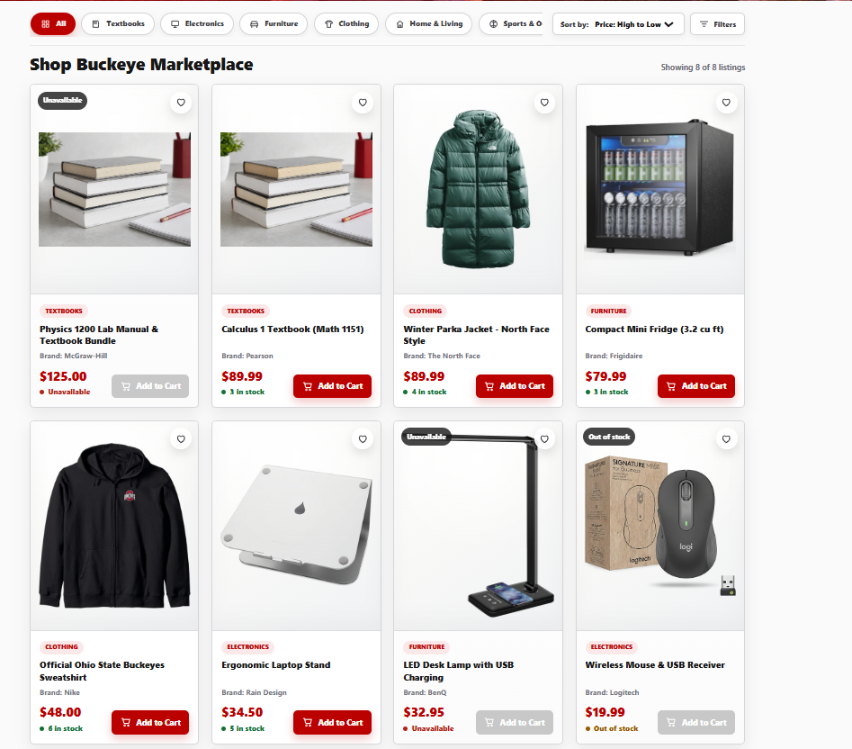

## Cart Flow

### Empty Cart

The cart view shown before any products have been added.

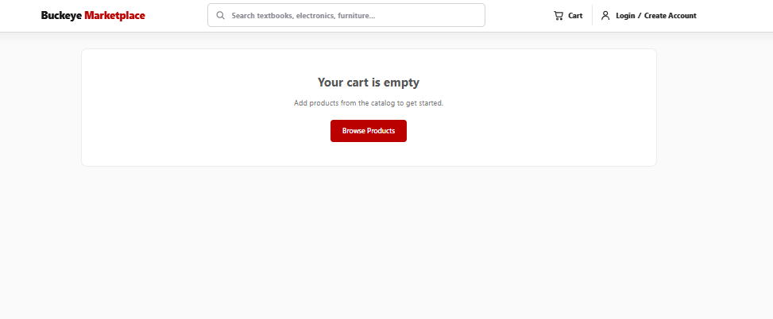

### Cart With Item

The cart view after adding one product, including quantity controls and the order summary.

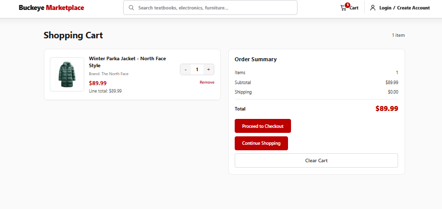

## Checkout Flow

### Checkout Choice

The checkout page lets customers log in, create an account, or continue as a guest.

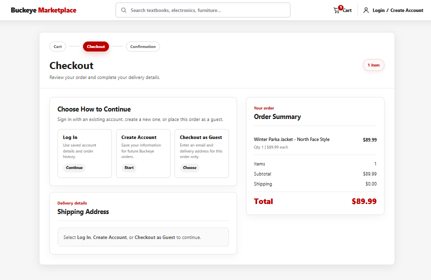

### Guest Checkout

Guest checkout collects contact information and shipping address details.

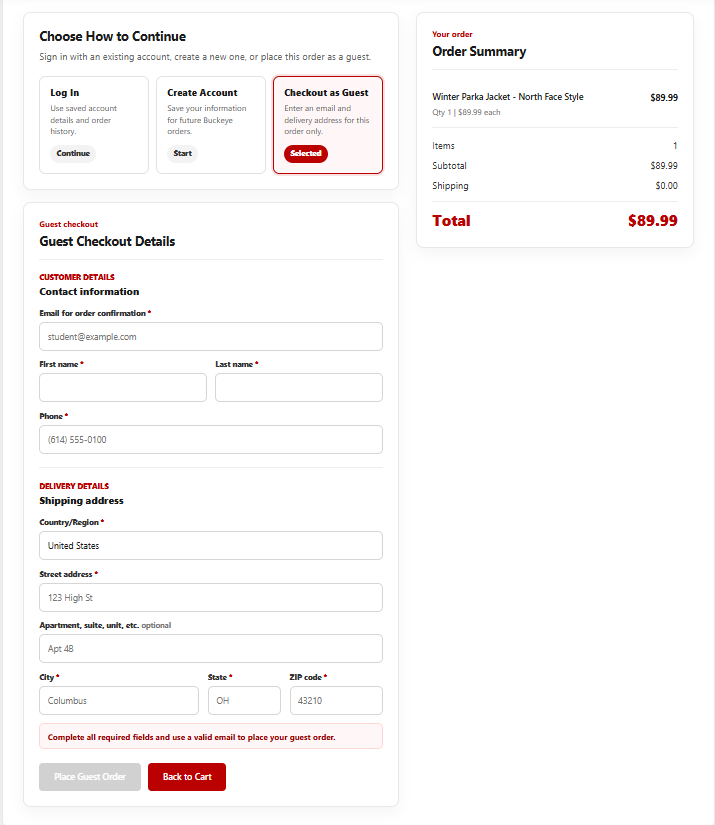

### Signed-In Checkout Validation

Signed-in checkout validates required delivery fields before placing an order.

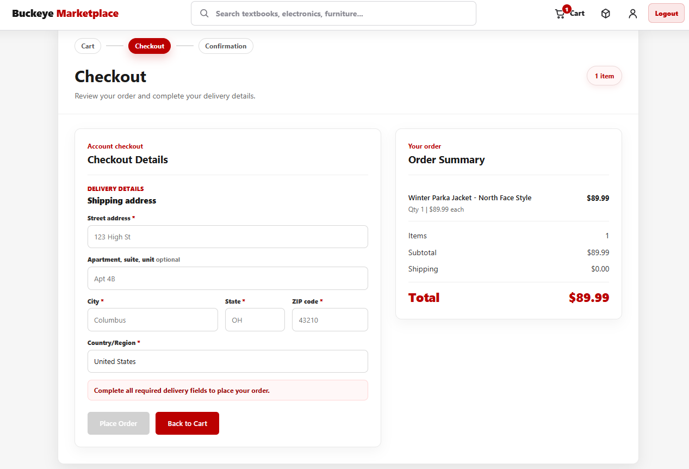

### Signed-In Checkout With Address

Signed-in checkout with delivery information filled in and ready to place the order.

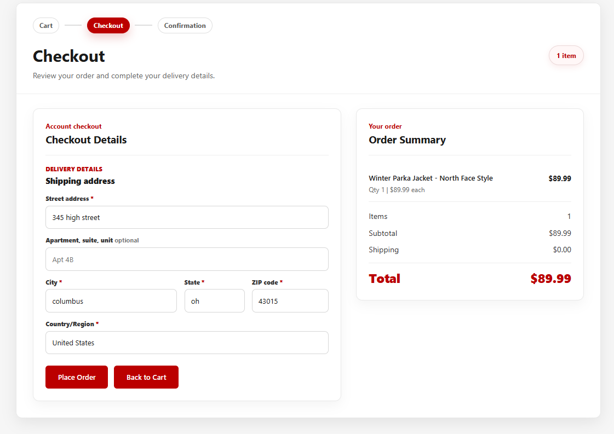

### Order Confirmation

The order confirmation screen displays the placed order number, status, total, email, and shipping address.

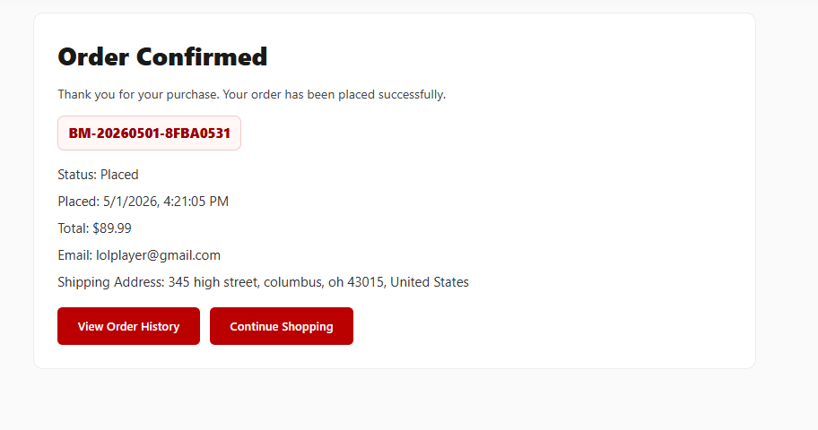

### Order History

The customer order history page lists previous orders for the signed-in account.

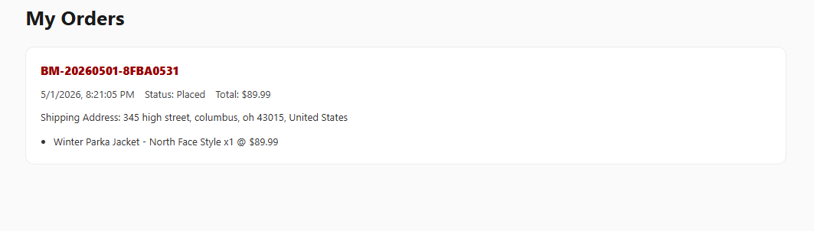

## Account Flow

### Login

The login screen for existing Buckeye Marketplace accounts.

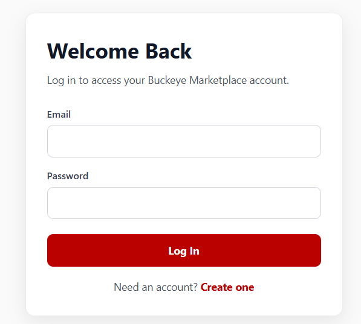

### Create Account

The registration screen for creating a new Buckeye Marketplace account.

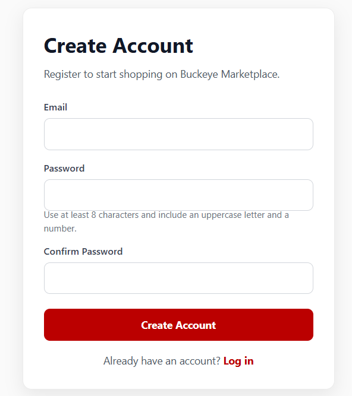

### Signed-In Navigation

The signed-in header shows the cart badge, account controls, admin access, and logout action.

## Admin Dashboard

### Add Product

The admin dashboard includes a form for creating new marketplace products.

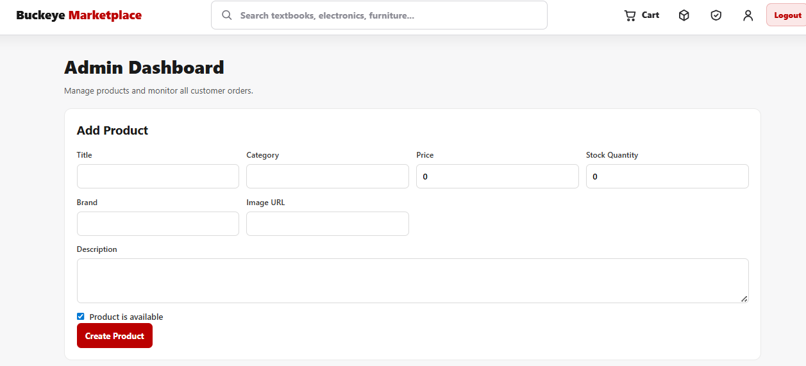

### Product Management

The admin product management table lists products with price, stock, availability, and edit/delete actions.

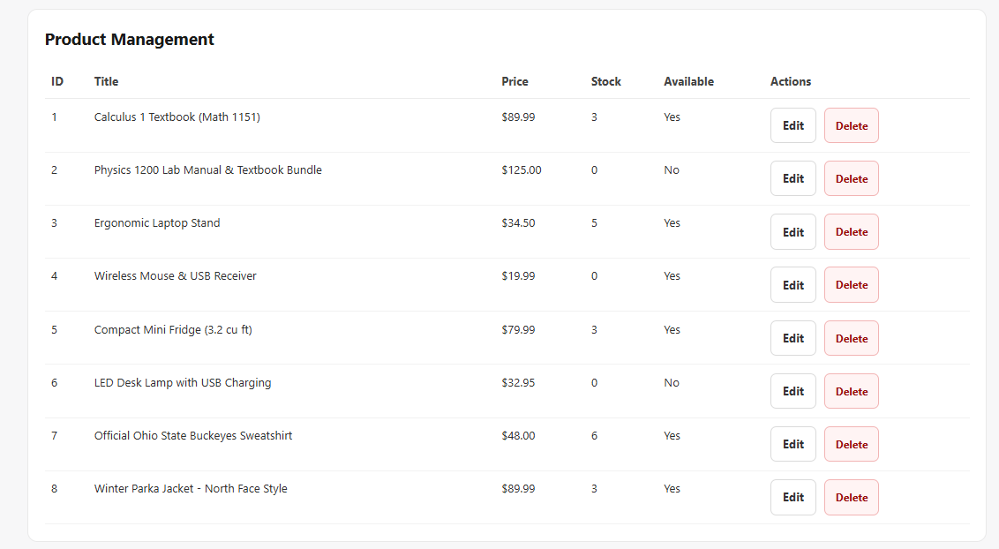

### All Orders

The admin orders table shows placed orders, customer information, totals, shipping addresses, and status updates.

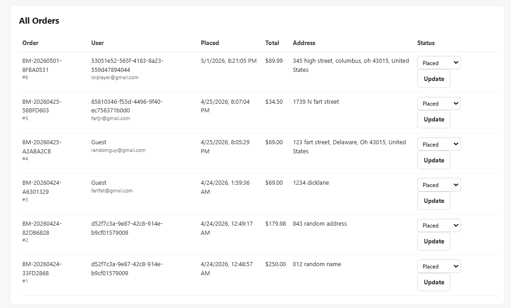
